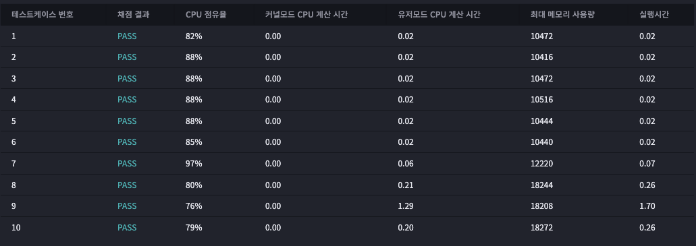

# 2023년 01월 04일
## 불이야!! ★2
  
### 문제


--- 
## testcase 1
input
```
5 5
...&.
..###
#.###
.....
....@
```
output
```
8
```
## testcase 2
input
```
5 5
...&.
..###
#####
.....
....@
```
output
```
-1
```
## testcase 3
input
```
10 10
@.@#.#.#@@
.#.##.##.@
@@.#.@.@@#
@@.#.#.@#&
#.@#@.@@##
@.##@@#...
@@#@@#@@#@
@@.#@@@..#
.#..@#@@@#
#...@#.@@@
```
output
```
-1
```
## testcase 4
input
```
50 50
...@....#.@...#..@.##....@.........@......#.....@.
#.....#.###.#...##....@.@.....##...#.#.#....@#....
##..#.#....@@.##@.###..#...@.#...#@#.##.#@..#.....
.##..##@..#.#..#....#.@...#...#............#..@..@
.#..#.........#..#..#@.....#..##@...####..#..#...@
#.#@..#..#.##.##..#...#........@....@..@@.@...#@@.
.#...##.#..#.@..#.....#.#.....@#....#...##...#....
.@..#...##.#...##@#.#@.#...@@@#..#@@..@..#....##@#
.@.#..@...##.@#..@#..@.#.@#@.#.....@.#..#.....##.#
##@@.#.....@.#@.###.@@#..#.....##......@..###.....
...#@.##..@###.#.#.......#.##@...#.#@......#...#..
#..@...#.@.#..@.......#@....#...###@...@.......@.#
#..##@....#....@....#..#@....###..#........#.....@
...@##...@#.#.#..#..#.###...@..@.##..##.#@..@#....
#@###@......##@..@@.##.@.##...@.#.#...#...#...##.#
.#.@.@.#...@.......##@#..#..@@....#@...##.##.#@.@.
#.@..#..#...@@..@#@..@#..#....@......##.##@#@#.#.#
.#..#.@......##.@.#@...##@##.##...@@.##...@.@.@###
.#.#...#@#.#...@#....@#.###..@#@###....##....#...#
#...@@..........@..@@..##.#.....#.....@.#...#..#.#
..#@#....#@.........##..@.#@...#@####..#.@........
.....@@#...@#@....#..##..##.#@##...@#....#.@..@...
........#.##@@.#........#...@.#..@..#..#..#.....#.
.##....#.........#.@.@...@.#@@....#.#.#.@..#@...#.
.#..#...@...#..@##@....#...#.#..#..@..#.#.#.#.@#..
.##@##@..@.@####.....#.#@...#...........@@..##....
....#.#@....#.@...#.@......#..........#.....@.#...
#.....#..@@......#.@...@..#@.#@@..#.@.@.....@..#@.
.##.#...@..#.##@....#@#@....#....@.@#.....@..#@..#
##......##..#..##@.#.....#......#.##...##@.......#
..#.@####.#.....##@#.#.###..@#....#@....#@.#.@#...
####....@......#.....@...#..#....#.........@.....#
@..#.#.#.#....#@##.#....##.@....@#..#...#..#.#.#..
...#....@....#..##.###@#.#.....#.##.#...@#@..##..@
.@...##@##.....#..@..#.@#..@.#.@@@#...#.##.##.....
#@#..#..##@..#......@#.....@..##..##@.#@#.##...#..
@..#@#@.@.#.@..#...@.@.##.@.@#...#...##..#@..##...
.@.#...#....#@#.@.@@.##@#@......#.#.@##.#..@...#@.
.##@.#@@..#@...##....@.....#..#.@.@...@#.#...@##@.
.......@..#...#.#.##.............#..##.@..##.#@#.#
.@@#@...#.....##...@@.@#.#...#..............#..@..
.....#.@@##...@@@@.&....#..##..@#####....#..######
.#.@#.....@.#.#..@.#...#..@...#....@.#.....#.#..#@
###@#........@###...@.#.##.#.....@.##.@.....#.#@.@
#..#@#..@..#..@...##..@....@#..........@......@#.#
.......#.##.....##..#..@..##...#.##.##.##.........
..#..@@.#.......#@..@##.....@@@...@...#.#..#..@...
..##.#....#.@....@.###.@.#.####..#..#.##.....###..
..#.@..#.#...#....@..#.#.@#..@.....#....##.@#..#..
...##..#..#..#.@@....@..#....#..@..@.#....#@..#...
```
output
```
0
```


### 내 제출 결과




## 푼 방식

사람의 지점에서 4방향으로 갈라지도록 하며 지나간 곳은 체크 후 다시 가지 않고 벽면일때도 못가게한후

갈수 있는 방향의 좌표에서 불이 난 곳이 있으면 while 문을 멈추고 count 를 출력,

또한 x*y//2+x+y 개수 만큼 반복시에 없다면 -1출력(더 많이 줄일 수 있을듯)

중간에 갈 방향이 없어져도 -1 출력
