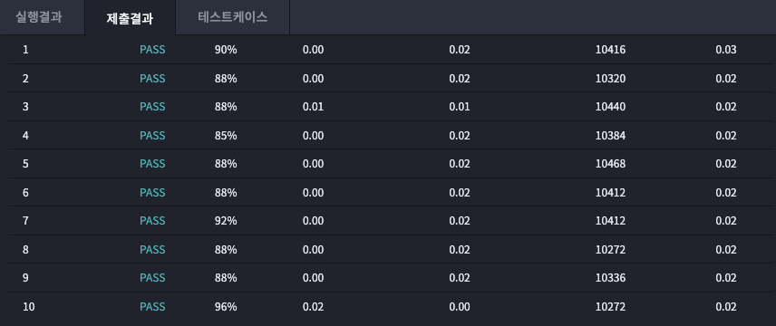

# 2023년 01월 05일
## 여름의 대삼각형 ★1
  
### 문제


--- 
## testcase 1
input
```
0 0
3 0
0 4
```
output
```
6.00
```
## testcase 2
input
```
-7 -4
0 -9
8 8
```
output
```
79.50
```
## testcase 3
input
```
-7689 -8990
-3215 3647
-5730 2639
```
output
```
13636131.50
```
## testcase 4
input
```
-10 -11
347 285
18197 15085
```
output
```
0.00
```


### 내 제출 결과




## 푼 방식

헤론의 공식을 사용하여 풀이 (3변의 길이를 구한후 공식 대입)

좌표만 주어질 때는 신발끈의 정리가 더 좋은 풀이 방법이다.
