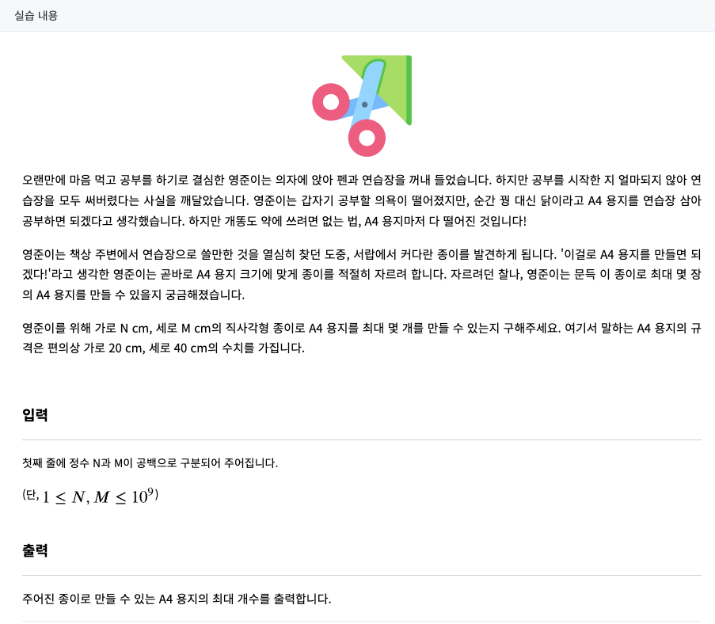
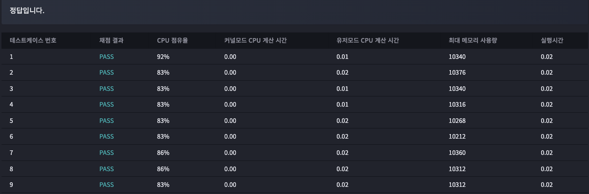

# 2023년 01월 06일
## A4 용지를 만들자 ★2
  
### 문제



--- 
## testcase 1
input
```
50 60
```
output
```
3
```
## testcase 2
input
```
180 214
```
output
```
45
```
## testcase 3
input
```
4429 3893
```
output
```
21437
```
## testcase 4
input
```
1000000000 7
```
output
```
0
```


### 내 제출 결과




## 푼 방식

가로 세로방식으로 배치할수 있는 a4용지 개수를 더한다음 두개가 중복되어서 있는 개수를 뺀다
