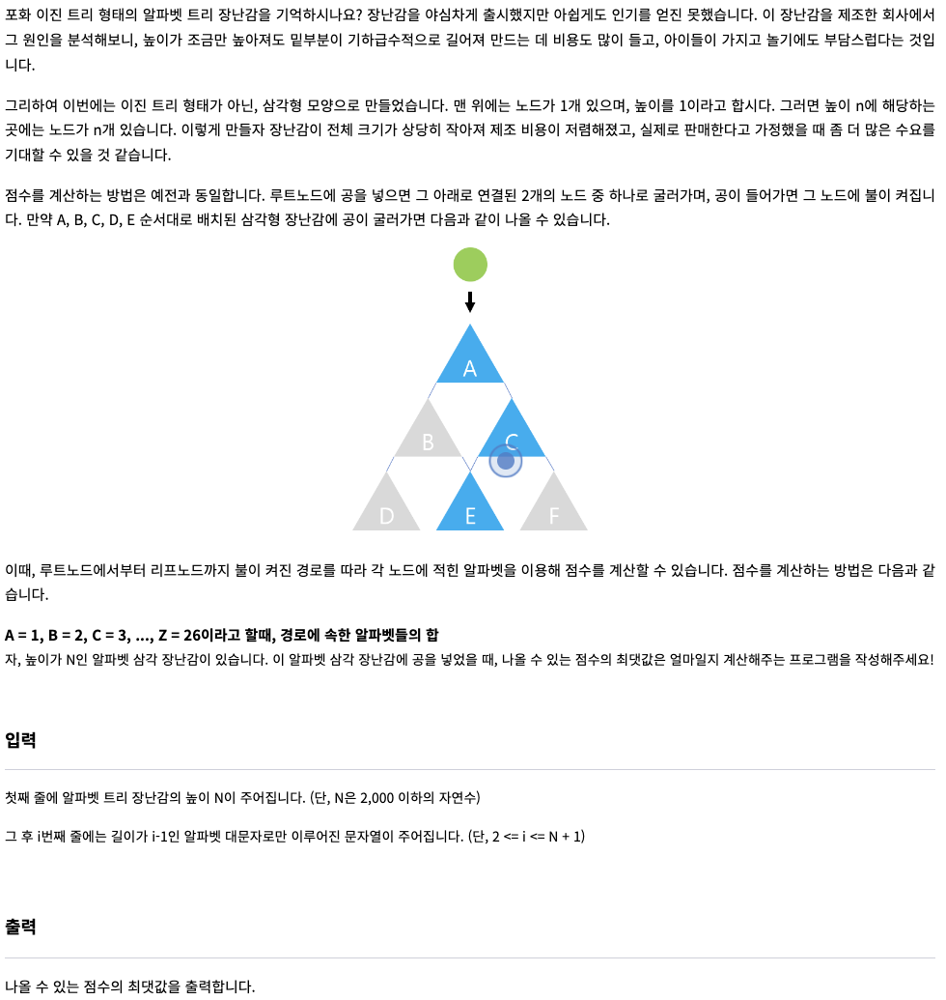
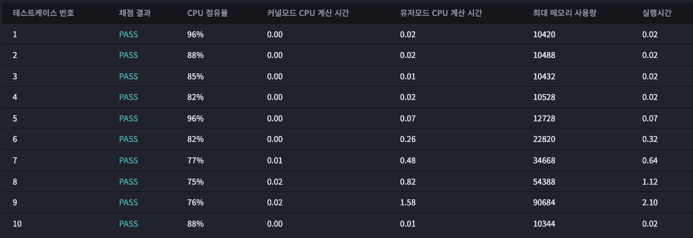

# 2023년 01월 06일
## A4 용지를 만들자 ★2
  
### 문제



--- 
## testcase 1
input
```
9 2
ABCCBCCDA
```
output
```
ADA
```
## testcase 2
input
```
10 3
ABCCCBBAAA
```
output
```
CLEAR!
```
## testcase 3
input
```
30 2
ABEBADEEBDCDABABECCAEDACBBABDC
```
output
```
ABEBADBDCDABABEAEDACABDC
```
## testcase 4
input
```
10 2
ABAAACBCCA
```
output
```
ABCBA
```


### 내 제출 결과




## 푼 방식

리스트에서 하나씩 가고 stack에 저장된 알파벳의 갯수를 저장하고 그것이 m값을 넘을 경우 반대쪽 list인 afterli에 넘겨진 알파벳을 pop 한다.

해설 : 스택사용 ex) (a,1),(b,2) ~~ 
