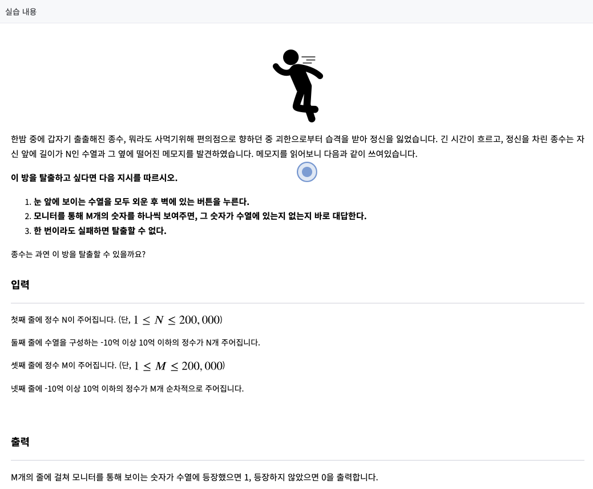
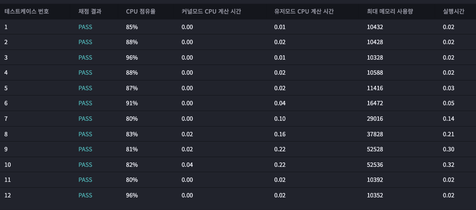

# 2023년 01월 11일
## 방 탈출하기 ★2
  
### 문제



--- 
## testcase 1
input
```
6
5 -7 6 9 0 -3
3
9 -9 6
```
output
```
1
0
1
```
## testcase 2
input
```
10
4 -6 9 -2 0 -7 -9 -3 -1 -5
10
4 10 5 9 -8 -10 -8 4 10 -5
```
output
```
1
0
0
1
0
0
0
1
0
1
```
## testcase 3
input
```
5
1 7 9 5 2
10
1 2 3 4 5 6 7 8 9 10
```
output
```
1
1
0
0
1
0
1
0
1
0
```
## testcase 4
input
```
10
-7 5 -9 1 -45 17 62 -8 55 103
20
1 5 9 11 23 47 6485 12346 -456 -47 4 -45 13 8 4 545 103 -62 -9 55
```
output
```
1
1
0
0
0
0
0
0
0
0
0
1
0
0
0
0
1
0
1
1
```


### 내 제출 결과




## 푼 방식
if in 으로 모니터에 나온 문자 하나씩 찾기
그냥찾으면 시간초과가 나오기 때문에 기본 수열을 딕셔너리에 넣어서 찾게 만듬

해설 : 이진탐색(Binary Search) ex) [bisect — Array bisection algorithm](https://docs.python.org/3.0/library/bisect.html)
정렬 후 이진탐색으로 푼다면 O((N+M)log N) 의 시간복잡도로 줄일 수 있다.