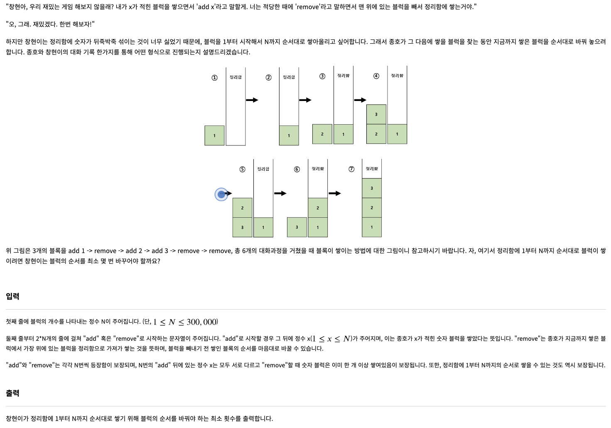
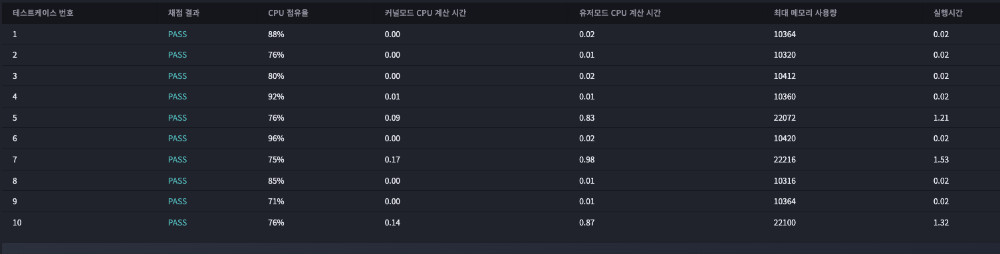

# 2023년 01월 12일
## 숫자 블럭 쌓기 ★3
  
### 문제



--- 
## testcase 1
input
```
3
add 1
remove
add 2
add 3
remove
remove
```
output
```
1
```
## testcase 2
input
```
7
add 3
add 2
add 1
remove
add 4
remove
remove
remove
add 6
add 7
add 5
remove
remove
remove
```
output
```
2
```
## testcase 3
input
```
2
add 1
remove
add 2
remove
```
output
```
0
```
## testcase 4
input
```
14
add 7
add 2
add 13
add 5
add 12
add 6
add 4
add 1
add 14
remove
add 10
remove
add 9
add 8
add 11
add 3
remove
remove
remove
remove
remove
remove
remove
remove
remove
remove
remove
remove
```
output
```
3
```


### 내 제출 결과




## 푼 방식
처음에는 그냥 remove 일때마다 [-1]인덱스와 일치하지 않으면 리스트 정렬을 했는데 시간초과가 나와버렸다.
문제에 무조건 가능한 경우만 나온다고 했기 때문에 리스트 정렬을 가상으로 한것으로 하는 ston 이라는 변수를 넣어 풀었다.

해설 : 같음